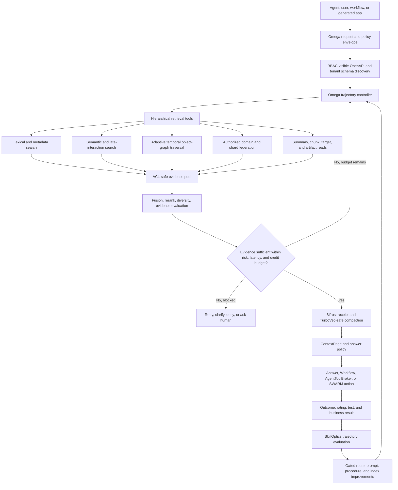

# Product Requirements Document: GrayMatter OmegaRAG

Status: Canonical implementation contract

Owner: Valkyr Labs product and platform engineering

Product surface: GrayMatter Cloud, GrayMatter Light, ValkyrAI, ThorAPI, SWARM, Workflow Studio, ValorIDE, Codex, OpenClaw, MCP, Bifrost, TurboVec, and SkillOptics

Last updated: 2026-07-13

Target release train: Omega foundation in the next active `rc-x`; staged expansion after signature-contract recovery

Decision rule: a capability is "shipped" only after its authenticated live contract, isolation tests, and release evidence pass

## 1. Executive Mandate

GrayMatter OmegaRAG will be the governed operational context plane for enterprise agents: a durable, tenant-isolated memory and object graph that can discover an authorized business schema, plan a retrieval trajectory, search across lexical, semantic, graph, temporal, hierarchical, and federated sources, compile bounded evidence into a policy-aware ContextPage, coordinate work through SWARM and ValkyrAI Workflow, and improve the full trajectory through SkillOptics.

OmegaRAG is not another vector database wrapper, chat-history store, or standalone GraphRAG experiment. It turns the existing GrayMatter and ValkyrAI stack into one closed-loop memory product:

1. ThorAPI defines and generates the tenant's business objects, relationships, API operations, RBAC, ACL, and secure fields.
2. GrayMatter remembers durable facts, decisions, episodes, procedures, artifacts, and object relationships.
3. The Omega controller exposes hierarchical retrieval tools and chooses the next retrieval action from evidence sufficiency, risk, latency, and credit state.
4. Bifrost preserves an end-to-end evidence and policy receipt while TurboVec compacts only already-authorized evidence.
5. ContextPages provide addressable, hydratable, recompressible context to any agent or workflow.
6. SWARM, Workflow Studio, SageChat, ValorIDE, Codex, OpenClaw, and MCP share the same scoped memory and trace IDs.
7. SkillOpt selects routes, records outcomes, evaluates complete trajectories, and promotes improvements only through explicit safety and release gates.

The product wins by combining capabilities competitors usually sell separately: automatic agent memory, generated business semantics, temporal knowledge graphs, hybrid retrieval, agentic retrieval control, policy receipts, workflow execution, multi-agent continuity, prompt/context engineering, usage economics, and developer surfaces.

## 2. Category and Positioning

### 2.1 Category

**Governed Agentic Memory and Retrieval Control Plane**

This category sits above vector infrastructure and below every agent, application, and workflow. It is the durable context, authorization, retrieval, evidence, and learning layer for operational AI.

### 2.2 Positioning statement

For organizations building agents that must understand and act on real business systems, GrayMatter OmegaRAG is the tenant-isolated agentic memory and retrieval control plane that grounds every answer and action in the authorized business object graph. Unlike generic memory APIs, vector databases, or framework-specific stores, OmegaRAG generates its semantics and access controls from ThorAPI, returns auditable receipts and reusable ContextPages, coordinates shared memory across SWARM runtimes, and improves retrieval trajectories with SkillOptics.

### 2.3 Defensible wedge

The primary wedge is not raw retrieval quality in isolation. It is **authorized operational usefulness**:

> The right evidence, from the right tenant and business objects, at the right time and cost, with enough proof to answer or act safely.

Every product decision and benchmark must optimize that outcome.

## 3. Why Now

The 2026 RAG frontier is converging on four ideas that align with the existing GrayMatter substrate:

- **Hierarchical retrieval interfaces:** systems such as A-RAG let an agent choose keyword search, semantic search, and chunk reads rather than forcing one monolithic retrieve call.
- **Adaptive graph traversal:** A2RAG and related work adjust traversal depth to evidence sufficiency, latency, and cost instead of using a fixed hop count.
- **Distributed and domain-scoped retrieval:** SCOUT-RAG expands across relevant domains and agents only when local evidence is insufficient.
- **Trajectory-level control and evaluation:** Agentic RAG is a controlled decision process; query rewrites, search actions, reads, stops, retries, and final answers must be evaluated as a sequence, not only as a final top-k list.

GrayMatter already has the hard enterprise substrate these systems usually omit: a durable object graph, RBAC-visible live OpenAPI, generated object services, retrieval receipts, answer-policy gates, ContextPages, SWARM trace continuity, SkillOpt routing, credit telemetry, KMS-backed field protection, and PostgreSQL/pgvector support. OmegaRAG turns those ingredients into one coherent product.

## 4. Product Truth and Evidence State

### 4.1 Evidence tiers

All engineering, sales, documentation, and benchmark claims use these tiers:

| Tier | Meaning | Allowed language |
| --- | --- | --- |
| Live verified | Authenticated endpoint and tenant-isolation contract passed in the target environment | Shipped, available, supported |
| Implemented, live unverified | Code and tests exist, but the target live contract has not passed or is currently failing | Implemented, preview, pending live verification |
| Planned | PRD, design, or research intent without completed implementation evidence | Planned, target, roadmap |

Control-surface declarations and OpenAPI presence do not by themselves establish live availability.

### 4.2 Baseline snapshot

The 2026-07-13 authenticated inspection established this starting point:

- Live api-0 identified as ValkyrAI CORE API v0.9.25 with 1,027 paths and 185 tags visible to the current principal.
- Hosted semantic health was healthy with OpenAI `text-embedding-3-small`, 1,536-dimensional rows, 709 active rows, and one stale row.
- PostgreSQL reported pgvector 0.8.2 available in the `valkyrai` schema with 256, 384, 1,536, and 3,072 dimension support.
- Code implements query planning, multi-provider fanout, RRF fusion, deterministic and remote reranking, late interaction, temporal filters, evidence evaluation, ACL filtering, ContextPage assembly, redaction, policy gates, and credit-aware behavior.
- ValorIDE implements receipt-first context acquisition with raw query fallback, ContextPage operations, session capability discovery, memory write/retry, and receipt inspection.
- Workflow Studio exposes GrayMatter query/write behavior and preserves server-derived principals, but does not yet expose the full Omega retrieval tool surface.
- Four signature live checks failed and are release-blocking until recovered: retrieval-receipt creation, retrieval-context assembly, object-graph shape, and semantic-index manifest.

The signature failures are Phase 0 work. No launch may hide them behind a control-surface capability declaration.

## 5. Problem Statement

Current agent-memory products tend to optimize one layer while leaving the operational system fragmented:

- memory APIs are easy to adopt but often flatten business semantics, policy, and provenance;
- vector databases retrieve chunks but do not decide when an agent should search, traverse, read, stop, or ask for approval;
- graph products model relationships but often require a separate authorization, workflow, memory, and context stack;
- agent frameworks store checkpoints but tie memory to one runtime;
- hyperscaler memory services reduce setup but increase platform lock-in and do not become the application's generated business schema;
- connector-centric context clouds ingest broadly but may not enforce object-level business permissions or executable workflow policy end to end;
- RAG evaluation commonly scores final answers while missing expensive, unsafe, or misleading intermediate trajectories.

The resulting failure modes are unacceptable for agents that edit code, operate customer data, run workflows, spend credits, or deploy systems:

- cross-tenant or cross-principal leakage;
- stale, contradicted, or superseded facts presented as current truth;
- high-recall retrieval that returns unusable or unauthorized evidence;
- fixed graph traversal that is either shallow and incomplete or slow and costly;
- opaque prompt stuffing with no receipt, provenance, or stop reason;
- every agent runtime creating its own memory silo;
- learning loops optimizing success while degrading security or cost;
- generated schemas changing while indexes, tools, and prompts remain stale;
- local fallback stores quietly becoming a second source of truth.

## 6. Goals and Non-Goals

### 6.1 Goals

1. Make GrayMatter the default durable context plane for every ValkyrAI agent, generated application, and workflow.
2. Beat generic memory products on business-semantic depth, tenant security, inspectability, and operational integration while matching their simple developer experience.
3. Beat vector and graph infrastructure on end-to-end task usefulness by controlling the whole retrieval trajectory.
4. Make temporal and contradictory knowledge first-class so agents can distinguish what was true, what is true, when it changed, and why.
5. Make retrieval adaptive to evidence sufficiency, risk, latency, token budget, and credits.
6. Share policy-aware memory across ValorIDE, Codex, OpenClaw, MCP, SageChat, SWARM, and Workflow without weakening per-agent or per-user scopes.
7. Automatically track generated ThorAPI schemas, objects, relationships, ACLs, and schema migrations.
8. Turn every retrieval and downstream outcome into evaluable SkillOptics evidence.
9. Provide cloud, tenant-hosted, and GrayMatter Light paths with an explicit capability and trust matrix.
10. Publish credible, reproducible benchmarks for quality, isolation, latency, cost, and multi-agent continuity.

### 6.2 Non-goals

- Replacing PostgreSQL, pgvector, OpenSearch, or external graph/vector providers as general-purpose databases.
- Creating a second handwritten persistence model beside ThorAPI-generated objects and services.
- Letting clients select or submit principal ownership fields that the server must derive.
- Allowing autonomous learning to modify production policy, permissions, prompts, or procedures without review gates.
- Treating all retrieved text as instructions; evidence remains untrusted content.
- Claiming full GrayMatter Cloud parity in GrayMatter Light where graph, KMS, or tenant-isolation guarantees are absent.
- Making one LLM, embedding model, vector store, agent framework, or cloud mandatory.

## 7. Users and Jobs To Be Done

| Persona | Primary job | OmegaRAG outcome |
| --- | --- | --- |
| Application developer | Add durable, secure memory and RAG without assembling six products | Generated SDK and MCP calls, one-shot query, inspectable receipts, local-to-cloud path |
| Agent/workflow author | Give an agent the right context and tools for a task | Declarative memory profile, retrieval modes, stop budgets, ContextPage output |
| Business operator | Ask questions and execute work across authorized objects | Source-cited answers and approval-gated actions over the live business graph |
| Security/compliance owner | Prove who retrieved what and why | Tenant/RBAC enforcement, redaction, policy decision, receipt chain, deletion proof |
| Data/knowledge steward | Keep indexes, facts, and relationships current | Schema-aware ingestion, freshness dashboards, contradiction queues, reindex controls |
| AI/platform engineer | Tune quality, latency, and spend | Trajectory traces, evaluation suites, routing policies, provider portability, credit telemetry |
| Multi-agent operator | Preserve context across agents, handoffs, and machines | SWARM-scoped memory, leases, checkpoints, replay, typed handoff ContextPages |
| Generated-app owner | Make a ThorAPI application agent-ready | Automatically generated retrieval tools, schema manifests, memory profiles, and index jobs |

## 8. Product Principles

1. **Authorization precedes retrieval.** Candidate generation, graph expansion, hydration, and reranking operate only on server-derived authorized scope.
2. **Generated semantics are the source of truth.** New durable models and relationships originate in `api.hbs.yaml` or the relevant canonical OpenAPI/template source and are regenerated through `./vaix`.
3. **One memory plane, many scoped views.** User, project, organization, workflow, swarm, agent, session, and application scopes are views over GrayMatter, not independent stores.
4. **Receipts are part of the result.** Every production retrieval returns or references a durable receipt, trajectory, policy decision, and evidence set.
5. **Adaptive depth beats fixed depth.** The controller spends more only when expected evidence gain justifies latency, credits, and risk.
6. **Context is compiled, not dumped.** ContextPages are budgeted, deduplicated, redacted, ordered, cited, and hydratable.
7. **Temporal truth is explicit.** Valid time, transaction time, supersession, contradiction, and confidence are modeled rather than implied by timestamps.
8. **Learning is gated.** SkillOptics may recommend and evaluate changes; production promotion requires objective gates and human review for material behavior.
9. **Degradation is visible.** Fallbacks preserve safety and report lost capability; they never silently turn a governed query into unscoped raw search.
10. **Portability is strategic.** Provider adapters, MCP contracts, SDKs, and Light mode prevent lock-in while Cloud supplies the strongest governance.
11. **No claim outruns evidence.** Feature status is live verified, implemented/unverified, or planned.
12. **Human approval remains binding.** Outbound sends, merges, production deploys, and high-risk effects always require explicit approval.

## 9. End-to-End Architecture



### 9.1 Architectural layers

| Layer | Responsibility | Existing substrate to extend |
| --- | --- | --- |
| Consumer surfaces | IDE, chat, plugin, MCP, agents, workflows, generated apps | ValorIDE GrayMatter services, SageChat, Codex/OpenClaw plugin, MCP server, Workflow Studio |
| Omega control plane | Plan, execute, stop, retry, clarify, and emit trajectory | `RetrievalQueryPlanner`, `RetrievalReceiptRuntimeService`, `RetrievalEvidenceEvaluator`, SkillOpt route logic |
| Context engineering | Assemble, redact, compress, cache, hydrate, and cite | `RetrievalContextAssembler`, `ContextPageRuntimeService`, TurboVec hooks, Bifrost receipt conventions |
| Retrieval providers | Lexical, semantic, graph, hierarchy, target reads, external sources | full-text/native Java search, `PgVectorSemanticIndexStore`, graph provider, late-interaction and HTTP providers |
| Durable knowledge plane | Memories, temporal facts, procedures, artifacts, business objects, relationships | MemoryEntry and generated ThorAPI object graph |
| Coordination/action plane | Multi-agent runs, workflow steps, tools, approvals, replay | SWARM contracts, `SwarmCommandService`, `WorkflowExecutionService`, `AgentToolBroker` |
| Evaluation/optimization | Route selection, outcome capture, trajectory scoring, promotion gates | `SkillOptRuntimeService`, `SkillSignal`, route receipts, EventLog monitor |
| Trust/economics | Tenant scope, ACL, KMS, redaction, audit, credit and latency budgets | generated ACL/RBAC, security aspects, KMS/SecureField, credit ledger and receipt chain |

### 9.2 Query lifecycle

1. Authenticate the caller and derive tenant, principal, organization, roles, grants, application, project, workflow, swarm, agent, and session scope on the server.
2. Load the caller's RBAC-visible OpenAPI/schema manifest and applicable memory profile.
3. Classify query intent, complexity, freshness, temporal need, risk, and requested operating mode.
4. Produce an explicit retrieval plan with initial tools, maximum hops, domain scope, latency, token, and credit budgets.
5. Execute only authorized tools. Every step records inputs by hash/reference, candidates, filtered counts, timing, cost, and stop rationale.
6. Fuse and rerank evidence, then evaluate coverage, contradiction, freshness, authority, diversity, and safety.
7. If insufficient and budget remains, choose the next best tool or expand one authorized domain/hop. Otherwise clarify, retry, deny, or request approval.
8. Compile the evidence into a ContextPage with citations, redactions, hydration pointers, answer policy, and receipt chain.
9. Answer or route the ContextPage into a workflow/SWARM action through the existing broker and approval gates.
10. Record the downstream result and evaluate the complete trajectory in SkillOptics.

## 10. Operating Modes

| Mode | Use case | Default budget and behavior |
| --- | --- | --- |
| `FAST` | IDE autocomplete, simple memory lookup, interactive UI | Cached schema; lexical + vector; no remote domain expansion unless required; p95 target 300 ms |
| `BALANCED` | Default agent/chat/workflow grounding | Hybrid search, bounded graph expansion, rerank, ContextPage; p95 target 900 ms |
| `DEEP` | Research, multi-hop analysis, complex business questions | Adaptive domain and graph expansion, hierarchy reads, stronger evaluators; p95 target 3 s or caller budget |
| `AUDIT` | Compliance, incident review, high-stakes decisions | Maximum provenance, temporal reconstruction, contradiction reporting, no answer if proof gate fails |
| `PRIVATE` | Restricted or local-sensitive tasks | Local/approved providers only, no external reranker or embedding call, strict disclosure ledger |

Modes are policy presets, not authorization shortcuts. A tenant may tighten any mode but may not weaken mandatory security and approval rules.

## 11. Competitive Attack Map

This map describes product targets, not unverified claims about current competitor implementations.

| Competitive surface | Market leader or pattern | Gap OmegaRAG must close | OmegaRAG counter-position |
| --- | --- | --- | --- |
| Temporal agent knowledge graph | Zep/Graphiti-style bi-temporal memory | GrayMatter lifecycle currently relies too heavily on ordinary timestamps/stale markers | Native valid-time + transaction-time facts, supersession, contradiction resolution, temporal graph queries |
| Drop-in automatic memory | Mem0-style one-call formation | Current users must understand lower-level write/query contracts | One-call `remember`, extraction, dedupe, consolidation, forgetting, profiles, SDK quickstarts—with server policy and receipts |
| Connector-rich context cloud | Supermemory-style broad ingestion and profiles | Connector/catalog depth and sync UX are not yet category-leading | Managed connectors, profile-aware indexing, CDC, source manifests, sync SLAs, schema and ACL preservation |
| Open ontology/graph memory | Cognee and open graph stacks | GrayMatter needs easier ontology extension and graph inspection | Live OpenAPI-derived ontology, generated relationships, graph explorer, user-defined safe mapping overlays |
| Managed vector memory | Weaviate Engram and vector vendors | Vector providers may win on operational simplicity and latency | Match managed setup while adding business-object semantics, graph/temporal retrieval, receipts, actions, and provider portability |
| Hyperscaler agent memory | AWS AgentCore, Google Memory Bank, cloud-native stores | Hyperscalers win distribution and integrated ops | Cloud + self-host/Light portability, multi-provider agents, generated application schema, no single-runtime lock-in |
| Framework memory | LangGraph/LangMem, Letta, agent runtimes | Framework-native state is easy inside one runtime | First-class adapters plus memory that survives framework, model, IDE, workflow, and machine changes |
| Vector infrastructure | Pinecone, Weaviate, Qdrant, pgvector | Best-in-class ANN platforms expose scale and tuning controls | Treat them as pluggable providers; win at authorized planning, graph fusion, receipts, context compilation, and business outcomes |
| GraphRAG analytics | Microsoft GraphRAG, Neo4j graph ecosystems | Community/global/local graph retrieval can be deeper than GrayMatter's current graph search | Add community summaries, adaptive traversal, temporal paths, graph analytics, and evidence-sufficiency stopping over the operational graph |
| RAG orchestration libraries | Modular agentic RAG frameworks | Composability and research velocity can outpace a product stack | Stable retrieval-tool ABI, provider SPI, declarative policies, replayable trajectories, benchmark harness |
| Enterprise search | Search platforms with mature connectors and relevance tooling | Ingestion breadth, relevance workbench, and admin operations | Schema-aware connectors, hybrid ranking lab, feedback loop, source freshness, access propagation, action-ready results |
| Prompt/context engineering | Prompt stores and context optimizers | Memory can be good but context assembly still opaque | ContextPages, Bifrost trace, TurboVec compaction, prompt compiler, token-value attribution, per-item hydration |
| Evaluation/observability | RAG eval and tracing vendors | Current evaluation is not yet trajectory-complete or publicly benchmarked | SkillOptics native trajectory evaluation tied to business outcomes, cost, policy, and promotion gates |

### 11.1 Win themes

OmegaRAG must be able to demonstrate these claims with live evidence:

- **More useful than memory APIs:** it remembers the business object, relationship, temporal validity, policy, and action context—not only a sentence.
- **More complete than vector databases:** it decides what to search, why to expand, when to stop, how to compile context, and whether an answer/action is allowed.
- **More operational than GraphRAG:** its graph is the live RBAC-scoped application graph and can drive approved workflows.
- **More portable than hyperscaler memory:** the same contracts work across Codex, OpenClaw, ValorIDE, MCP, cloud, and local modes.
- **More governable than agent-framework memory:** every step is tenant-scoped, receipt-backed, budgeted, replayable, and evaluable.
- **More adaptive than fixed pipelines:** it chooses retrieval interfaces, graph depth, domain expansion, reranking, and compression based on evidence gain.

## 12. Functional Requirements

Priorities mean:

- `P0`: launch-blocking foundation or trust requirement.
- `P1`: required for the OmegaRAG category promise and general availability.
- `P2`: expansion that compounds the moat after the core contract is reliable.

### 12.1 Omega contract and control plane

| ID | Priority | Requirement | Acceptance evidence |
| --- | --- | --- | --- |
| OMR-CORE-001 | P0 | Provide one versioned Omega request/response contract that returns a ContextPage, retrieval receipt, trajectory reference, answer policy, cost, latency, and warnings. | OpenAPI contract, generated Java/TS/Python clients, authenticated live test, backward-compatibility test |
| OMR-CORE-002 | P0 | Derive principal, tenant, organization, roles, and ownership on the server. Ignore or reject client-owned identity/ACL fields. | Unit, integration, and cross-tenant negative tests |
| OMR-CORE-003 | P0 | Repair and continuously smoke-test receipt creation, retrieval-context assembly, graph-shape, and semantic-manifest signature endpoints. | Live canary checks pass in staging and production for seven consecutive days |
| OMR-CORE-004 | P0 | Persist a durable trajectory for every production Omega execution, including every tool call, policy decision, budget update, and stop reason. | Readable trajectory linked from the receipt and redacted replay test |
| OMR-CORE-005 | P0 | Expose deterministic `plan`, `execute`, `inspect`, `cancel`, and `evaluate` operations. | OpenAPI and MCP contract tests; idempotency/replay coverage |
| OMR-CORE-006 | P0 | Fail closed on missing tenant/authorization context and fail controlled on provider degradation. No silent unscoped raw-search fallback. | Chaos and negative tests verify explicit degraded policy and zero scope expansion |
| OMR-CORE-007 | P1 | Support synchronous one-shot execution and asynchronous resumable execution for deep trajectories. | Same result envelope, stable trace ID, cancel/resume integration test |
| OMR-CORE-008 | P1 | Support caller-specified `FAST`, `BALANCED`, `DEEP`, `AUDIT`, and `PRIVATE` modes subject to tenant policy. | Policy precedence tests and mode-specific benchmark results |
| OMR-CORE-009 | P1 | Allow safe deterministic plans to execute without an LLM while retaining optional model-based planning behind Bifrost routing. | Deterministic planner suite and provider-offline test |
| OMR-CORE-010 | P1 | Publish capability discovery that reports live-verified operations, degraded providers, limits, and Light/Cloud differences. | Capability response is derived from real checks, not only configuration flags |

### 12.2 Hierarchical agentic retrieval interface

The Omega controller receives bounded tools rather than an unrestricted database or HTTP client.

| ID | Priority | Requirement | Acceptance evidence |
| --- | --- | --- | --- |
| OMR-RET-001 | P0 | Expose `keyword_search` with PostgreSQL FTS/BM25-compatible relevance, phrase/prefix support, filters, snippets, and authoritative source IDs. | Relevance suite, SQL-injection tests, ACL filtered counts |
| OMR-RET-002 | P0 | Expose `semantic_search` with provider/dimension manifest checks, metadata filters, freshness, and authorized candidate generation. | pgvector and portable-Java provider parity tests |
| OMR-RET-003 | P0 | Expose `chunk_read` and `target_read` separately from search so the controller can inspect exact evidence only when justified. | Receipt shows search-to-read lineage and bounded bytes/tokens |
| OMR-RET-004 | P0 | Expose `graph_expand` with relationship allowlists, direction, temporal point/range, maximum hops, node/edge caps, and policy filters. | Cross-tenant, path explosion, and temporal correctness tests |
| OMR-RET-005 | P0 | Expose `schema_inspect` over only the RBAC-visible OpenAPI/schema surface. | Authenticated schema snapshots differ correctly by role/tenant |
| OMR-RET-006 | P1 | Expose `summary_search`, `community_search`, and `hierarchy_expand` for RAPTOR/GraphRAG-style coarse-to-fine retrieval. | Summary provenance and parent/child trace tests |
| OMR-RET-007 | P1 | Expose `context_hydrate`, `context_recompress`, `context_diff`, and `context_cite` over ContextPages. | Stable page refs, hydration pointers, diff and citation tests |
| OMR-RET-008 | P1 | Expose `temporal_reconstruct`, `conflict_inspect`, and `supersession_read`. | Temporal benchmark and contradiction casebook |
| OMR-RET-009 | P1 | Permit tenant-approved remote/domain retrieval through a brokered provider tool; never expose unrestricted egress. | Egress allowlist and selective-disclosure tests |
| OMR-RET-010 | P2 | Support multimodal text/image/table/code/audio evidence descriptors with modality-specific reads and unified receipts. | Cross-modal benchmark and safety review |

Each tool result must include a typed status, authorized scope hash, source IDs, scores, timestamps, policy flags, estimated evidence value, elapsed time, credits, and a continuation token when applicable.

### 12.3 Query planning and adaptive control

| ID | Priority | Requirement | Acceptance evidence |
| --- | --- | --- | --- |
| OMR-PLAN-001 | P0 | Classify query intent, complexity, temporal sensitivity, freshness, risk, and likely domains before retrieval. | Labeled planning benchmark with deterministic fallback |
| OMR-PLAN-002 | P0 | Support exact query, keyword variants, semantic variants, step-back, HyDE, decomposition, and multi-hop subquestions under policy and budget. | Planner test matrix and receipt-visible transformation lineage |
| OMR-PLAN-003 | P0 | Maintain explicit remaining budgets for time, credits, provider calls, graph hops, candidates, bytes, and context tokens. | Budget cannot be exceeded under retries or parallel fanout |
| OMR-PLAN-004 | P0 | Compute evidence sufficiency from coverage, authority, freshness, contradiction, diversity, and task-specific thresholds. | Calibrated evaluator benchmark and abstention tests |
| OMR-PLAN-005 | P0 | Choose `continue`, `expand`, `read`, `rerank`, `retry`, `clarify`, `ask_approval`, `answer`, or `deny` after each step. | Complete action/state transition tests |
| OMR-PLAN-006 | P1 | Estimate expected evidence gain per millisecond and credit before expanding a graph or domain. | Logged estimate vs actual gain and cost calibration |
| OMR-PLAN-007 | P1 | Execute independent safe searches in parallel while applying one shared cancellation and budget envelope. | Fanout cancellation, partial failure, and deterministic fusion tests |
| OMR-PLAN-008 | P1 | Cache reusable plan fragments by query class, schema manifest, policy version, and memory profile—not by raw tenant content. | Cache isolation and invalidation tests |
| OMR-PLAN-009 | P1 | Ask a concise clarification when ambiguity blocks useful retrieval instead of spending the whole budget blindly. | Ambiguity benchmark and user-friction metric |
| OMR-PLAN-010 | P2 | Use SkillOptics-approved contextual bandit or learned policy candidates for tool selection while preserving deterministic policy overrides. | Shadow evaluation, no-regression gates, reversible rollout |

### 12.4 Adaptive temporal graph traversal

| ID | Priority | Requirement | Acceptance evidence |
| --- | --- | --- | --- |
| OMR-GRAPH-001 | P0 | Traverse the generated ThorAPI object graph using schema relationships and generated ACLs; no parallel free-form graph may bypass the source model. | Graph ABI contract, relationship normalization, authorization tests |
| OMR-GRAPH-002 | P0 | Support local/entity, path, neighborhood, and bounded multi-hop queries with path citations. | Graph relevance suite and exact path reproduction |
| OMR-GRAPH-003 | P1 | Add bi-temporal facts and edges with valid-from/to and recorded-from/to semantics. | Backdated correction, late-arriving fact, and as-of query tests |
| OMR-GRAPH-004 | P1 | Model supersedes, contradicts, corroborates, derived-from, and scoped-to relationships explicitly. | Conflict resolution and provenance graph tests |
| OMR-GRAPH-005 | P1 | Adapt traversal depth, relationship classes, and branch width to evidence sufficiency, risk, and budget. | Quality/cost curve beats fixed one-hop and fixed three-hop baselines |
| OMR-GRAPH-006 | P1 | Generate community summaries and hierarchical entity/topic rollups with source membership and freshness. | Global/local query benchmark and summary invalidation tests |
| OMR-GRAPH-007 | P1 | Score path authority, recency, relationship confidence, and diversity; avoid high-degree-node domination. | Adversarial hub-node and stale-edge tests |
| OMR-GRAPH-008 | P2 | Provide graph analytics adapters for centrality, communities, similarity, path constraints, and anomaly detection. | Provider-neutral SPI and benchmark |
| OMR-GRAPH-009 | P2 | Provide a temporal graph visualizer and explainable traversal replay in ValorIDE and the web console. | Usability test and receipt-to-visual consistency |

### 12.5 Distributed and domain-scoped retrieval

| ID | Priority | Requirement | Acceptance evidence |
| --- | --- | --- | --- |
| OMR-FED-001 | P0 | Define a `RetrievalDomain` as a tenant-scoped set of schema types, sources, providers, policy, freshness, and budget rules. | Generated model, CRUD ACLs, and domain resolution tests |
| OMR-FED-002 | P0 | Route queries first to the smallest authorized domain set likely to answer them. | Domain-classification benchmark and no unauthorized probing |
| OMR-FED-003 | P0 | Prohibit cross-tenant federation. Cross-domain expansion is allowed only inside a derived tenant/authorization envelope. | Exhaustive isolation matrix and attack tests |
| OMR-FED-004 | P1 | Support distributed domain agents that return evidence envelopes, never unrestricted raw stores. | SCOUT-style local-first expansion benchmark and signed envelope tests |
| OMR-FED-005 | P1 | Expand to a new domain only when current evidence is insufficient and expected value exceeds configured cost/risk. | Expansion precision, avoided-call rate, and cost results |
| OMR-FED-006 | P1 | Merge results using global source identity, dedupe hashes, temporal alignment, and policy precedence. | Duplicate/conflict/freshness integration cases |
| OMR-FED-007 | P1 | Support tenant-controlled data residency and provider locality rules. | Regional routing and denied-egress tests |
| OMR-FED-008 | P2 | Support privacy-preserving evidence summaries and selective disclosure between approved organizational domains. | Security design review and red-team benchmark |

### 12.6 Indexing and knowledge formation

| ID | Priority | Requirement | Acceptance evidence |
| --- | --- | --- | --- |
| OMR-IDX-001 | P0 | Maintain a live `SemanticIndexManifest` keyed by tenant schema, source type, provider, model, dimension, chunker, index version, and ACL strategy. | Signature endpoint, manifest drift alert, startup compatibility check |
| OMR-IDX-002 | P0 | Update indexes post-commit from generated object lifecycle events; never index uncommitted or unauthorized payloads. | Transaction rollback, CDC ordering, and ACL propagation tests |
| OMR-IDX-003 | P0 | Support full reindex, incremental reindex, estimate/dry-run, stale cleanup, tombstones, retry, and resumable jobs. | Operational API tests and no-orphan acceptance |
| OMR-IDX-004 | P0 | Preserve source object ID, field/section locator, content hash, schema version, owner/tenant scope, valid time, and provenance in every index row. | Random-row traceability audit |
| OMR-IDX-005 | P1 | Generate default index policies from ThorAPI field metadata while allowing reviewed tenant overrides. | Schema-to-policy generation snapshots |
| OMR-IDX-006 | P1 | Exclude SecureField plaintext and fields denied for retrieval before embedding, summarization, or external provider calls. | Secret canary suite and provider disclosure ledger |
| OMR-IDX-007 | P1 | Add contextual chunking, hierarchical summaries, table-aware, code-aware, document-layout-aware, and conversation-aware indexers. | Corpus-specific benchmark suite |
| OMR-IDX-008 | P1 | Add managed connectors with source ACL mapping, incremental sync, backfill, deletion propagation, freshness SLOs, and per-source receipts. | Connector certification harness |
| OMR-IDX-009 | P1 | Detect near duplicates, entity aliases, contradictions, and candidate relationships during formation, with confidence and review states. | Formation precision/recall and steward queue tests |
| OMR-IDX-010 | P1 | Support embeddings and indexes at 256, 384, 1,536, and 3,072 dimensions with explicit migration; never mix incompatible rows silently. | Dimension migration and fallback tests |
| OMR-IDX-011 | P2 | Support multimodal embeddings and OCR/table/image descriptors without losing original-source lineage. | Multimodal traceability audit |
| OMR-IDX-012 | P2 | Provide tenant-defined retention, legal hold, forgetting, re-embedding, and crypto-shredding workflows. | Deletion proof and retention policy tests |

### 12.7 Automatic durable memory

OmegaRAG must match the ease of drop-in memory products without giving up typed business truth.

| ID | Priority | Requirement | Acceptance evidence |
| --- | --- | --- | --- |
| OMR-MEM-001 | P0 | Provide one-call `remember` and `recall` APIs and SDK methods that return receipts and explicit scope. | Five-minute quickstart and generated SDK tests |
| OMR-MEM-002 | P0 | Classify memories as working, episodic, semantic, procedural, preference, decision, task/todo, artifact, or business-object fact. | Formation benchmark and user correction flow |
| OMR-MEM-003 | P0 | Link a memory to typed ThorAPI objects when authorized and confident; otherwise preserve it as scoped MemoryEntry with candidate links. | Link precision and no-phantom-object tests |
| OMR-MEM-004 | P1 | Deduplicate, merge, supersede, corroborate, and contradict memories with provenance and reviewability. | Long-running conversation and correction benchmarks |
| OMR-MEM-005 | P1 | Maintain `MemoryProfile` policies for scope order, types, retention, extraction, consolidation, provider privacy, and token budget. | Profile inheritance and tenant override tests |
| OMR-MEM-006 | P1 | Consolidate episodes into summaries/procedures only after thresholds and policy gates; originals remain traceable. | Consolidation fidelity and rollback tests |
| OMR-MEM-007 | P1 | Support explicit forget, scoped forget, expiration, retention, and legal-hold overrides with durable deletion receipts. | End-to-end forget verification across source and indexes |
| OMR-MEM-008 | P1 | Learn preferred names, style, domain vocabulary, and stable working rules without treating untrusted third-party content as user instruction. | Prompt-injection and personalization tests |
| OMR-MEM-009 | P2 | Offer proactive memory suggestions and contradiction review queues without silently mutating critical truth. | Suggestion precision and acceptance-rate metrics |

### 12.8 Retrieval, ranking, and context engineering

| ID | Priority | Requirement | Acceptance evidence |
| --- | --- | --- | --- |
| OMR-CTX-001 | P0 | Generate candidates through lexical, vector, graph, temporal, metadata, and hierarchy channels and fuse them with receipt-visible scores. | Per-channel and fused relevance benchmarks |
| OMR-CTX-002 | P0 | Apply authorization before expensive reranking and again as a final output guard. | Filter-order instrumentation and leakage tests |
| OMR-CTX-003 | P0 | Support RRF, weighted fusion, deterministic reranking, MMR/diversity, late interaction, and tenant-approved remote rerankers. | Relevance/cost comparison matrix |
| OMR-CTX-004 | P0 | Compile ContextPages within a hard token budget using authority, relevance, freshness, diversity, and task value. | Token ceiling and context utility benchmark |
| OMR-CTX-005 | P0 | Redact secrets, credentials, private keys, restricted fields, and policy-denied spans before any prompt or external provider call. | Secret canary and structured redaction receipt |
| OMR-CTX-006 | P0 | Treat evidence as quoted/untrusted data, preserve citations, and surface prompt-injection safety signals. | Injection-resilience benchmark |
| OMR-CTX-007 | P1 | Attribute token usage and downstream answer value to individual evidence items and retrieval steps. | Token-value report and evaluator correlation |
| OMR-CTX-008 | P1 | Support ContextPage cache, diff, fork, hydrate, recompress, expire, pin, and share-by-policy operations. | Lifecycle and access tests |
| OMR-CTX-009 | P1 | Provide prompt compilers for chat, code, workflow, research, audit, and action contexts from the same ContextPage. | Cross-surface consistency and task success tests |
| OMR-CTX-010 | P1 | Use TurboVec only after ACL-safe evidence selection for bounded chunking/compaction; preserve hydration pointers and source hashes. | Compression fidelity, no-leak, and hydration round-trip tests |
| OMR-CTX-011 | P1 | Use Bifrost to preserve provider route, disclosure, policy, model, cost, trace, and fallback decisions end to end. | Receipt chain completeness test |
| OMR-CTX-012 | P2 | Optimize context ordering and compression using SkillOptics-approved policies in shadow mode before promotion. | Controlled experiment and no-regression gate |

### 12.9 SWARM shared memory and workflow action

| ID | Priority | Requirement | Acceptance evidence |
| --- | --- | --- | --- |
| OMR-SWARM-001 | P0 | Use GrayMatter durable objects as the source of truth and WebSocket/SWARM as the live coordination bus. | Disconnect/replay and multi-machine recovery tests |
| OMR-SWARM-002 | P0 | Carry `traceId`, `receiptRef`, `contextPageRef`, `skillOptReceiptRef`, `workflowExecutionRef`, tenant scope, and capability grant on every command/handoff. | Contract conformance and missing-ref rejection tests |
| OMR-SWARM-003 | P0 | Provide scoped shared memory for organization, project, application, workflow, swarm, agent, run, and session with explicit inheritance. | Scope precedence and isolation matrix |
| OMR-SWARM-004 | P0 | Use leases, idempotency keys, checkpoints, bounded retries, and durable cursors for every agent run. | Duplicate delivery and crash recovery tests |
| OMR-SWARM-005 | P0 | Route tool actions through `AgentToolBroker`/existing workflow brokers and capability grants. | No direct high-risk action path in architecture scan |
| OMR-SWARM-006 | P0 | Preserve human approval for outbound sends, merges, production deploys, and critical/high-risk effects. | One-call approval, denial, expiry, and replay tests |
| OMR-SWARM-007 | P1 | Implement typed memory handoffs containing task state, decisions, unresolved questions, evidence refs, and minimum necessary ContextPage slices. | Handoff continuity benchmark across Codex/OpenClaw/ValorIDE |
| OMR-SWARM-008 | P1 | Resolve concurrent memory updates through version checks and explicit conflict objects, never silent last-write-wins for binding decisions. | Concurrency and conflict-resolution tests |
| OMR-SWARM-009 | P1 | Add Omega retrieval, context hydration, temporal query, evaluation, and receipt modules to Workflow Studio. | Palette, parameter mapper, save/run/preview, and remote/local execution tests |
| OMR-SWARM-010 | P2 | Let domain agents perform local retrieval and return signed evidence envelopes to a coordinator under one budget. | Distributed retrieval benchmark and envelope verification |

### 12.10 SkillOptics trajectory evaluation and improvement

| ID | Priority | Requirement | Acceptance evidence |
| --- | --- | --- | --- |
| OMR-EVAL-001 | P0 | Link every retrieval trajectory to its answer/action outcome, user rating/correction, tests, workflow result, credit debit, and policy decision when available. | Trace join completeness ≥ 99.9% for production Omega calls |
| OMR-EVAL-002 | P0 | Score both final output and intermediate decisions: plan quality, tool choice, expansion utility, read utility, stop correctness, citation support, and wasted cost. | Evaluator agreement study and labeled trajectory set |
| OMR-EVAL-003 | P0 | Separate deterministic policy gates from probabilistic quality evaluators. Quality cannot override security. | Architecture and mutation tests |
| OMR-EVAL-004 | P1 | Maintain task-specific evaluation profiles for memory recall, code work, workflow action, business analysis, audit, and research. | Profile-specific benchmark coverage |
| OMR-EVAL-005 | P1 | Compare candidate routes/prompts/planners/index policies offline and in shadow mode before limited rollout. | Experiment registry, holdout set, rollback control |
| OMR-EVAL-006 | P1 | Promote only when quality improves without violating leakage, policy, latency, credit, or abstention guardrails. | Automated promotion gate and human approval record |
| OMR-EVAL-007 | P1 | Generate actionable root-cause findings: missing source, stale index, wrong domain, weak query, early stop, late stop, bad rerank, overcompression, or unsupported answer. | Diagnosis precision against labeled failures |
| OMR-EVAL-008 | P1 | Let approved improvements update Procedure, route weights, prompt compiler versions, index policy proposals, and benchmark cases with full lineage. | Versioned change and rollback proof |
| OMR-EVAL-009 | P2 | Learn per-tenant/task policies only above minimum evidence thresholds and without cross-tenant training-data leakage. | Privacy review and tenant-specific holdouts |

### 12.11 Surface integrations

| ID | Priority | Requirement | Acceptance evidence |
| --- | --- | --- | --- |
| OMR-SURF-001 | P0 | Codex and OpenClaw plugin startup runs invariant preflight, capability discovery, and schema freshness check. | Installed-cache smoke matrix |
| OMR-SURF-002 | P0 | MCP exposes portable `remember`, `recall`, `retrieve`, `context`, `graph`, `schema`, `trajectory`, and `evaluate` contracts with safe metadata handling. | Portable MCP contract suite |
| OMR-SURF-003 | P0 | ValorIDE uses receipt-backed Omega context for agent tasks and never silently falls back when policy requires a receipt. | Context provider, prompt assembly, quota, and degraded-state tests |
| OMR-SURF-004 | P0 | SageChat uses the reusable Workflow/Run/Broker path for model, retrieval, and tool steps; browser recursion is prohibited. | Workflow execution and UI replay tests |
| OMR-SURF-005 | P1 | ValorIDE provides ContextPage inspector, trajectory timeline, graph/path explorer, memory timeline, contradiction review, index health, and cost/quality panels. | UX acceptance and trace parity tests |
| OMR-SURF-006 | P1 | Workflow Studio exposes Omega modules with generated parameter contracts, receipts, approvals, and remote/local execution modes. | End-to-end workflow test matrix |
| OMR-SURF-007 | P1 | The Compositional App/API builder can attach a `MemoryProfile` and generate agent-ready retrieval tools from the authorized application schema. | Generate/build/run demo and schema change migration |
| OMR-SURF-008 | P1 | Generated applications receive typed SDK hooks, UI components, and policy-aware search/context endpoints without handwritten model duplication. | Multi-target codegen parity tests |
| OMR-SURF-009 | P1 | Provide adapters for OpenAI Agents, LangGraph/LangMem, Letta, LlamaIndex, and other major runtimes without surrendering GrayMatter as source of truth. | Adapter conformance suite |
| OMR-SURF-010 | P2 | Provide an admin relevance/evaluation studio and tenant-facing memory/graph governance console. | Operator usability and support-deflection metrics |

### 12.12 Security, privacy, and governance

| ID | Priority | Requirement | Acceptance evidence |
| --- | --- | --- | --- |
| OMR-SEC-001 | P0 | Enforce tenant, principal, role, grant, object ACL, field policy, and SecureField restrictions on every source and result. | Full authorization matrix with zero leakage |
| OMR-SEC-002 | P0 | Bind every receipt to auth context hash, policy version, schema manifest, provider route, and code/runtime version without exposing secrets. | Cryptographic/trace verification tests |
| OMR-SEC-003 | P0 | Prevent existence leakage through counts, timings, errors, schema discovery, graph degree, and cache behavior. | Side-channel red-team suite |
| OMR-SEC-004 | P0 | Detect prompt injection, data poisoning, provenance gaps, suspicious capsules, and instruction-shaped evidence; lower trust or deny as policy requires. | Adversarial corpus and false-positive review |
| OMR-SEC-005 | P0 | Record exactly which fields or evidence classes were disclosed to each external provider. | Provider disclosure ledger and audit export |
| OMR-SEC-006 | P0 | Require explicit approval for external sharing of restricted data and all high-risk effects; no learned policy can remove mandatory gates. | Policy mutation test and approval audit |
| OMR-SEC-007 | P1 | Support customer-managed keys, rotation, re-encryption, crypto-shredding, and per-domain provider policies. | KMS lifecycle test suite |
| OMR-SEC-008 | P1 | Provide retention, legal hold, DSAR/export, scoped forgetting, and deletion verification across source, indexes, caches, summaries, and trajectories. | Compliance workflow and deletion proof |
| OMR-SEC-009 | P1 | Support signed evidence envelopes and provenance verification for federated providers. | Signature, replay, and tamper tests |
| OMR-SEC-010 | P2 | Provide confidential-compute/private-retrieval options where customer tier and infrastructure permit. | Security architecture review and measured overhead |

### 12.13 Reliability, observability, and economics

| ID | Priority | Requirement | Acceptance evidence |
| --- | --- | --- | --- |
| OMR-OPS-001 | P0 | Emit per-step metrics for latency, candidates, filtered candidates, provider calls, hops, tokens, credits, failures, and stop reason without logging private content. | Telemetry schema and privacy test |
| OMR-OPS-002 | P0 | Provide live health for source, index, provider, graph, receipt, context, evaluator, connector, and credit subsystems. | Synthetic probes and runbook |
| OMR-OPS-003 | P0 | Reserve/estimate credits before expensive execution and debit from actual usage with one linked receipt chain. | Ledger reconciliation and insufficient-credit tests |
| OMR-OPS-004 | P0 | Bound retries, exponential backoff, circuit breakers, fanout, graph expansion, and async run duration. | Chaos suite and no-runaway guarantee |
| OMR-OPS-005 | P1 | Publish tenant dashboards for quality, cost, latency, freshness, connector lag, index drift, abstentions, conflicts, and policy blocks. | Dashboard QA and source definitions |
| OMR-OPS-006 | P1 | Expose explainable cost forecasts and cheaper valid alternatives before deep retrieval. | Forecast error and user choice metrics |
| OMR-OPS-007 | P1 | Support provider failover without mixing incompatible embeddings, losing provenance, or weakening privacy mode. | Failover and manifest compatibility tests |
| OMR-OPS-008 | P1 | Define backup, replay, disaster recovery, and index rebuild procedures with tested RPO/RTO. | Quarterly restore exercise |
| OMR-OPS-009 | P2 | Optimize provider selection by expected utility per credit and millisecond through gated SkillOptics policies. | Shadow and canary results |

## 13. ThorAPI Object Model

All durable model changes belong in ValkyrAI's canonical OpenAPI/ThorAPI source and are generated through `./vaix`. Before adding a model, engineering must prove that an existing generated object cannot carry the semantics cleanly. Runtime orchestration may use custom services and thin generated delegates; it may not create sidecar persistence or application JDBC bypasses.

### 13.1 Existing objects to preserve and extend

| Object family | OmegaRAG use |
| --- | --- |
| `MemoryEntry` | Concise durable fact, decision, preference, todo, artifact, or context with stable scope/provenance |
| `SemanticIndexEntry` | Search representation tied to a source target, index manifest, vector/text features, lifecycle, and ACL strategy |
| `RetrievalReceipt` and related request/item/policy/evaluator objects | Durable evidence, policy, score, cost, warning, and answer-decision record |
| `ContextPage` and item/request/response objects | Reusable compiled context, hydration pointers, compression state, citations, and receipt refs |
| `Agent`, `Run`, `Workflow`, `WorkflowExecution`, `Task`, `Goal`, `Procedure`, `EventLog` | Execution, coordination, checkpoint, procedure, and outcome context |
| `SkillOptRouteReceipt`, `SkillSignal`, `Rating` | Route selection, outcome, confidence, feedback, and improvement linkage |
| `Project`, `Application`, `Organization`, `Customer`, `Opportunity`, `ContentData`, `FileRecord` and generated domain models | Live business object graph and retrieval targets |

### 13.2 Minimum proposed schema delta

Exact naming may change during canonical schema review, but semantics may not be dropped.

| Proposed object | Purpose | Required relationships/fields |
| --- | --- | --- |
| `OmegaRetrievalPlan` | Versioned bounded plan | query hash, mode, intent, risk, schema/policy/profile versions, budgets, planned steps, status |
| `OmegaRetrievalStep` | One replayable tool decision | plan, sequence, tool, input/output refs, candidates, filtered count, evidence gain, latency, credits, error, stop rationale |
| `RetrievalTrajectory` | Complete plan-to-outcome trace | plan, steps, receipt, ContextPage, workflow/run/action, outcome, evaluator results, code/config versions |
| `RetrievalDomain` | Authorized domain/shard definition | tenant, schema types, source/provider refs, locality, policy, freshness, cost, status |
| `SemanticIndexManifest` | Compatibility and lifecycle authority for an index | tenant/domain/source type, provider/model/dimension, chunker, index version, ACL strategy, counts, freshness, health |
| `IndexJob` | Resumable index operation | manifest, mode, dry-run, cursor, counts, estimate/actual cost, state, errors, receipt |
| `TemporalFact` | Bi-temporal statement | subject, predicate, object/value, valid range, recorded range, confidence, provenance, status |
| `KnowledgeRelation` | Typed graph edge where generated relationships are insufficient | source/target type+id, predicate, temporal ranges, confidence, provenance, policy, supersession |
| `MemoryProfile` | Declarative memory/retrieval/context policy | applicable scopes, type rules, retention, formation, providers, retrieval mode, context budget, approvals |
| `MemoryEpisode` | Bounded interaction/event group before consolidation | participant/scope refs, interval, events/memories, summary, status, source receipt |
| `EvidenceEnvelope` | Signed federated evidence response | domain, auth/policy hash, items, disclosure, signature, expiry, cost/latency |
| `RetrievalEvaluation` | Task/trajectory evaluator result | trajectory, evaluator/profile/version, score dimensions, violations, diagnosis, recommendation |
| `OptimizationCandidate` | Proposed planner/prompt/procedure/index change | source evaluations, candidate version, expected impact, risk, status, approval, rollout |
| `MemoryConflict` | Explicit concurrent or semantic conflict | subjects, competing facts/versions, detection rationale, policy, resolution, resolver |

### 13.3 Temporal model contract

Every fact or relationship that can change independently must support:

- `validFrom` / `validTo`: when the statement is true in the represented domain;
- `recordedFrom` / `recordedTo`: when GrayMatter knew or stored that statement;
- `status`: active, superseded, contradicted, retracted, disputed, expired, or deleted;
- `confidence` and `authority`: source quality distinct from retrieval relevance;
- `provenanceRef`: source object, artifact, event, message, or signed envelope;
- `supersedesRef` / `conflictsWithRefs` / `corroboratesRefs` where applicable.

An ordinary `createdDate` cannot substitute for valid time. Corrections must close or supersede prior recorded intervals without rewriting history.

### 13.4 Scope contract

The server resolves the effective scope lattice:

```text
tenant
  organization
    application / project
      workflow / swarm
        agent / run
          session
            user preference overrides where policy permits
```

Scope inheritance is explicit and policy-controlled. A child may narrow access, never widen the caller's tenant or RBAC envelope. Shared memory requires a generated grant/capability; proximity in the lattice is not permission.

## 14. API and Tool Contracts

### 14.1 Canonical Omega operations

The final paths follow existing ValkyrAI naming and generated-controller conventions. The following semantic operations are required:

| Operation | Method intent | Result |
| --- | --- | --- |
| `/v1/graymatter/omega/capabilities` | Discover live-verified modes, tools, providers, manifests, limits, and degraded state | Capability manifest |
| `/v1/graymatter/omega/plan` | Create/estimate a plan without executing content reads | `OmegaRetrievalPlan` plus estimate |
| `/v1/graymatter/omega/query` | Plan and execute synchronously within bounded budget | ContextPage, receipt, trajectory summary |
| `/v1/graymatter/omega/runs` | Start a resumable deep retrieval | Run/trajectory ref and status |
| `/v1/graymatter/omega/runs/{id}` | Inspect, resume, or cancel | Run and bounded trace |
| `/v1/graymatter/omega/trajectories/{id}` | Read the authorized trajectory | Redacted plan, steps, evidence lineage, evaluations |
| `/v1/graymatter/omega/evaluate` | Evaluate an existing trajectory or benchmark case | `RetrievalEvaluation` |
| `/v1/graymatter/omega/remember` | Form and persist scoped memory | Memory refs, formation decisions, receipt |
| `/v1/graymatter/omega/forget` | Execute scoped forgetting/deletion | Deletion receipt and residual-state proof |
| `/v1/graymatter/omega/domains` | Manage authorized retrieval domains | Generated domain objects |
| `/v1/graymatter/omega/index-jobs` | Estimate/start/inspect/cancel index work | `IndexJob` and credit receipt |
| `/v1/graymatter/omega/conflicts` | List/inspect/resolve memory conflicts | Conflict objects and resolution receipt |

Existing MemoryEntry, semantic-index, retrieval-receipt, graph, ContextPage, SkillOpt, SWARM, and workflow APIs remain supported. Omega composes them; it does not break clients or duplicate their persistence.

### 14.2 One-shot request contract

```json
{
  "query": "What changed in the Acme renewal risk and what should the account team do next?",
  "mode": "BALANCED",
  "scope": {
    "projectRef": "optional-server-readable-ref",
    "applicationRef": "optional-server-readable-ref"
  },
  "asOf": "2026-07-13T18:00:00-07:00",
  "budgets": {
    "maxLatencyMs": 1200,
    "maxCredits": 5,
    "maxContextTokens": 5000,
    "maxGraphHops": 3
  },
  "requestedOutput": "CONTEXT_PAGE_AND_RECEIPT"
}
```

The request never accepts `principalId`, `ownerId`, tenant database/schema, raw ACL lists, or permission overrides. The server may accept object references only after verifying the caller can read them.

### 14.3 Response contract

Every successful or controlled-degraded response includes:

- `traceId`, `trajectoryRef`, `retrievalReceiptRef`, and `contextPageRef`;
- `status` and `answerPolicy`: answer, answer-with-warning, clarify, retry, ask-approval, deny, or unavailable;
- `coverage`, `confidence`, freshness, contradiction, and safety summaries;
- exact consumed latency, tokens, provider calls, graph hops, and credits;
- evidence citations with authorized source refs and optional hydration pointers;
- warnings, blocked domains/providers, fallbacks used, and recommended next action;
- schema, policy, memory-profile, index-manifest, planner, and evaluator versions.

HTTP 200 with an empty/unsafe context is not considered success. Typed policy/status is mandatory.

### 14.4 MCP and agent ABI

The portable ABI must expose small composable tools:

```text
graymatter_remember
graymatter_recall
graymatter_omega_plan
graymatter_omega_query
graymatter_keyword_search
graymatter_semantic_search
graymatter_graph_expand
graymatter_chunk_read
graymatter_target_read
graymatter_schema_inspect
graymatter_context_hydrate
graymatter_trajectory_inspect
graymatter_evaluate_outcome
graymatter_forget
```

Default agent installations should start with `graymatter_omega_query`, `remember`, `recall`, schema inspection, and trajectory inspection. Fine-grained tools become available to trusted retrieval-controller agents or explicit developer mode. Tool descriptions must state authorization, data handling, cost, and approval behavior.

### 14.5 Provider SPI

Providers implement a typed contract for:

- lexical search;
- vector search and embedding;
- late-interaction/reranking;
- graph traversal/analytics;
- document/target reads;
- summarization/compression;
- evidence evaluation;
- federated domain search.

Every provider advertises locality, supported dimensions/modalities, maximum batch, privacy tier, cost model, health, and deterministic fallback. Provider errors cannot alter the authorization envelope.

## 15. Compositional App and API Builder Integration

OmegaRAG becomes a generated capability of applications rather than a post-build integration.

### 15.1 Builder requirements

1. The builder lets an application owner enable OmegaRAG and select a reviewed `MemoryProfile`.
2. ThorAPI inspects schema types, descriptions, relationships, ACLs, searchable fields, SecureField markers, temporal fields, and operations.
3. The generator proposes retrieval domains and index policies with explicit diffs and security warnings.
4. Generated servers emit post-commit object lifecycle events for authorized indexing.
5. Generated clients receive typed query, ContextPage, receipt, and inspector components.
6. Generated MCP tools describe business-object operations from the caller's live RBAC-visible schema.
7. A schema migration invalidates affected manifests, tools, summaries, and caches and schedules an estimated/resumable migration job.
8. App build/test evidence includes Omega contract, isolation, indexing, and retrieval benchmark results.

### 15.2 Schema-aware retrieval advantage

The generated schema gives OmegaRAG information that chunk-only systems must infer:

- canonical type and field names;
- relationships and cardinality;
- object lifecycle and ownership;
- validation and enumerations;
- business operations and side effects;
- field-level sensitivity and encryption;
- queryable indexes and database capabilities;
- role/object ACL behavior;
- source URLs and generated client types.

OmegaRAG uses this metadata for query decomposition, domain routing, graph paths, filter generation, citation labels, safe tool selection, and action proposals. It must never assume an object family exists in every tenant; it discovers only the live authorized schema.

## 16. PostgreSQL and Storage Strategy

### 16.1 Default Cloud path

PostgreSQL remains the canonical durable operational store. The preferred search composition is:

- generated tenant-aware relational objects and joins;
- PostgreSQL full-text search for lexical retrieval;
- pgvector HNSW/compatible indexes for dense retrieval;
- generated relationships and bounded recursive traversal for operational graphs;
- temporal fact/relation tables for as-of reconstruction;
- external providers only when scale, modality, or approved capability requires them.

### 16.2 Isolation

Isolation claims require verification of the actual deployment's tenant schema/database boundary, datasource binding, generated ACL behavior, cache partitioning, index partitioning, object storage prefixing, and provider namespace. api-0 control-plane visibility alone is not proof of customer data-plane isolation.

### 16.3 Portability

The Java portable path must remain functional for Light or environments without pgvector. Provider parity means equivalent authorization, receipt, provenance, temporal, and policy behavior—not identical ranking scores. The capability manifest reports differences honestly.

### 16.4 External vector/graph providers

Pinecone, Weaviate, Qdrant, Neo4j, OpenSearch, and similar systems may be supported as providers. GrayMatter remains the source of truth for object identity, authorization, receipts, policy, and trajectory. External stores receive the minimum authorized representation and cannot become the only copy of provenance or deletion state.

## 17. Non-Functional Requirements and SLOs

### 17.1 Security and correctness

| Objective | Target |
| --- | --- |
| Cross-tenant or unauthorized evidence leakage | 0; release-blocking at any occurrence |
| Receipt/trajectory coverage for production Omega queries | 100% |
| Server-derived identity and authorization | 100% of operations |
| SecureField/plaintext secret disclosure to index/provider/prompt | 0 |
| Deletion propagation | 99.9% within configured SLA; provable residual-state report |
| Unsupported high-stakes answer when answer policy denies | 0 |

### 17.2 Availability and recovery

| Objective | Target |
| --- | --- |
| Omega synchronous API availability | 99.95% monthly, excluding explicit tenant provider outage |
| Receipt retrieval availability | 99.99% monthly |
| RPO for durable memories/receipts/trajectories | ≤ 5 minutes Cloud target |
| RTO for control plane | ≤ 30 minutes Cloud target |
| Index rebuild | Resumable, no source loss, progress and estimate visible |

### 17.3 Latency targets

Targets exclude caller network variance and are measured at the service boundary over representative authorized corpora:

| Path | p50 | p95 | Hard behavior |
| --- | --- | --- | --- |
| Cached memory/exact lookup | 75 ms | 200 ms | No LLM dependency |
| `FAST` hybrid retrieval | 150 ms | 300 ms | Controlled degraded result before deadline |
| `BALANCED` ContextPage | 400 ms | 900 ms | Cancel optional expansion at budget |
| `DEEP` adaptive trajectory | 1.2 s | 3 s | Async continuation when caller budget permits |
| Receipt/trajectory read | 75 ms | 250 ms | Redaction and auth included |

These targets are product goals and must not be marketed as current measurements until benchmarked live.

### 17.4 Scale targets

- 10 million active index entries per tenant-domain before mandatory sharding.
- 100 million total active index entries per Cloud deployment with horizontal provider expansion.
- 50 concurrent retrieval steps per tenant by default, policy configurable.
- Graph expansion caps and query timeouts prevent unbounded path explosion at any scale.
- Connector ingestion supports backpressure, resumable checkpoints, and deletion propagation.

### 17.5 Accessibility and usability

- Inspectors and governance UI meet WCAG 2.2 AA.
- A developer can complete authenticated `remember` and `recall` in under five minutes and an Omega ContextPage query in under fifteen minutes.
- Every warning or denial includes a plain-language reason and a safe next action.

## 18. Evaluation Framework and KPIs

### 18.1 North-star metric

**Authorized Useful Task Completion (AUTC):** the percentage of eligible agent tasks completed correctly with sufficient authorized evidence, valid citations, no policy violation, and within the configured latency/credit budget.

AUTC deliberately prevents a system from appearing successful by improving recall while leaking data, overspending, or producing unsupported actions.

### 18.2 Quality metrics

- authorized recall@k and precision@k;
- MRR and nDCG by task/domain;
- evidence coverage and authority;
- citation precision, citation completeness, and entailment;
- temporal accuracy and as-of reconstruction accuracy;
- contradiction detection and resolution precision/recall;
- answer correctness, abstention correctness, and clarification utility;
- graph path relevance and adaptive-hop utility;
- context utility per 1,000 tokens;
- multi-agent handoff task continuity;
- memory formation, dedupe, link, consolidation, and forgetting precision.

### 18.3 Efficiency metrics

- p50/p95/p99 end-to-end and per-tool latency;
- credits and provider cost per successful task;
- retrieval calls, graph hops, read bytes, and context tokens per success;
- avoided domain expansions and early-stop savings;
- cache hit rate with isolation correctness;
- connector/index freshness and lag;
- reindex time and stale-row rate.

### 18.4 Trust metrics

- unauthorized candidate generation attempts blocked;
- post-filter leakage rate;
- SecureField/secret canary exposure rate;
- prompt-injection attack success rate;
- receipt completeness and trace join rate;
- provider disclosure-policy compliance;
- approval bypass attempts and failures;
- delete/forget propagation time and residuals.

### 18.5 Product metrics

- time to first successful memory and Omega query;
- weekly active applications, workflows, agents, and developers;
- percentage of agent prompts grounded by a valid ContextPage;
- repeat ContextPage reuse/hydration rate;
- percentage of outcomes linked to trajectories;
- developer retention after first production integration;
- support incidents per 10,000 queries;
- Cloud/Light upgrade conversion and provider adoption.

## 19. OmegaBench

OmegaBench is the public and internal benchmark suite. Results must publish corpus, tenant/isolation configuration, model/provider versions, index manifest, budgets, hardware, failures, and confidence intervals.

### 19.1 External benchmarks

Use applicable public suites such as LoCoMo, LongMemEval, BEAM, RAGBench, CRAG, TREC RAG, and GraphRAG-style local/global query sets. Public scores never replace product-specific isolation and workflow benchmarks.

### 19.2 Valkyr-specific benchmark tracks

| Track | What it proves |
| --- | --- |
| Omega Memory | Formation, long-horizon recall, dedupe, preference, consolidation, correction, and forgetting |
| Omega Business Graph | Generated schema discovery, typed object links, multi-hop retrieval, community/global/local queries |
| Omega Temporal | As-of truth, late-arriving facts, supersession, contradiction, and temporal paths |
| Omega Isolation | Tenant, role, object, field, SecureField, cache, timing, graph-degree, and connector ACL resistance |
| Omega Agentic | Tool selection, decomposition, evidence-sufficiency stopping, clarification, and denial correctness |
| Omega Federation | Local-first domain routing, expansion precision, evidence envelopes, residency, and cost |
| Omega Context | ContextPage utility, compression fidelity, citations, prompt-injection resilience, and token value |
| Omega SWARM | Cross-agent/machine handoff, replay, concurrent updates, leases, approvals, and task continuity |
| Omega Workflow | Retrieval-to-approved-action success across generated business operations |
| Omega Schema Change | Index/tool/cache invalidation and regeneration after compatible and breaking schema changes |
| Omega Economics | Quality/latency/credit frontier under FAST/BALANCED/DEEP/PRIVATE modes |

### 19.3 Required baselines

Every significant retrieval change compares against:

1. lexical-only;
2. vector-only;
3. fixed hybrid fusion;
4. fixed one-hop graph;
5. fixed three-hop graph;
6. current production planner;
7. strongest approved competitor/reference implementation where licensing and reproducibility permit.

No optimization is accepted solely because its average answer score improves. Isolation, tail latency, credit cost, abstention, and worst-domain regressions are release gates.

## 20. UX Requirements

### 20.1 Developer experience

- One command/plugin install, auth-first activation, live capability discovery, quickstart, and a working `remember`/`recall`/Omega query.
- Generated TypeScript, Python, and Java SDKs with idiomatic async APIs and typed errors.
- Local emulator/GrayMatter Light path with a clear Cloud-difference banner.
- Sample integrations for Codex, OpenClaw, MCP, ValorIDE, SageChat, Workflow Studio, generated apps, OpenAI Agents, and LangGraph.
- A receipt/trajectory URL or ref in every SDK result and error.

### 20.2 Operator console

The console must provide:

- source and connector inventory with freshness and ACL status;
- index manifests, dimensions, provider health, stale rows, jobs, estimates, and cleanup;
- memory timeline, profiles, episodes, consolidation, conflicts, and forgetting;
- graph explorer with temporal slider, path citations, and relationship filters;
- trajectory explorer with step decisions, evidence gain, latency, credits, policy, and outcomes;
- ContextPage inspector with redaction, citations, token attribution, hydration, and diff;
- SkillOptics experiment, evaluator, promotion, and rollback views;
- tenant policy, KMS/provider disclosure, retention, and approval controls;
- benchmark and SLO dashboards.

### 20.3 Progressive disclosure

Default UX shows answer policy, citations, context quality, cost, and a concise explanation. Advanced tools reveal full trajectories, graph paths, manifests, and policy details. Deep functionality remains reachable without overwhelming first-time users.

## 21. Delivery Plan

The phases are gated by evidence, not dates alone. Work may proceed in parallel only when it does not weaken the signature contract or generated-model boundary.

### Phase 0: Product truth and signature reliability

Objective: make the current strongest features reliable enough to build on and sell honestly.

Required scope:

- repair live retrieval-receipt creation, retrieval-context assembly, object-graph shape, and semantic-index manifest;
- add authenticated production canaries and capability discovery derived from the canaries;
- preserve receipt-first behavior in ValorIDE/SageChat and remove unsafe silent fallback;
- establish OmegaBench isolation, retrieval, latency, and cost baselines;
- verify the live tenant/schema/index boundary, including caches and provider namespaces;
- publish Cloud/Light and implemented/live/planned matrices;
- add release evidence bundles to the existing GrayMatter packaging and installed-cache tests.

Exit gates:

- all four signature checks pass in staging and production for seven consecutive days;
- zero critical/high isolation or SecureField findings;
- receipts and trajectories cover 100% of targeted retrieval paths;
- baseline benchmark report is reproducible from source;
- capability discovery cannot report a failed signature feature as available.

### Phase 1: Omega control plane and universal surfaces

Objective: ship the unified, bounded, receipt-backed agentic retrieval loop.

Required scope:

- canonical Omega plan/query/run/trajectory contracts;
- hierarchical lexical, semantic, graph, schema, target-read, and ContextPage tools;
- explicit budgets, evidence-sufficiency evaluator, adaptive stop/clarify/deny;
- MemoryProfile and retrieval-domain foundations;
- full Workflow Studio Omega module set;
- Codex/OpenClaw/MCP/ValorIDE/SageChat integration;
- Compositional App/API builder hooks and generated SDKs;
- SkillOptics trajectory/outcome linkage and shadow evaluation.

Exit gates:

- `BALANCED` Omega beats fixed hybrid baseline on AUTC without security/cost regression;
- all consumer surfaces return the same receipt/ContextPage contract;
- cross-surface handoff completes the Omega SWARM benchmark;
- five-minute memory and fifteen-minute Omega quickstarts pass with a clean account;
- production promotion remains manual and reversible.

### Phase 2: Temporal graph, automatic memory, and federation

Objective: close the strongest category gaps and create durable differentiation.

Required scope:

- bi-temporal fact/relation model and as-of queries;
- supersession, contradiction, corroboration, and conflict workflows;
- automatic formation, typed object linking, episodes, consolidation, and deletion proof;
- adaptive graph depth and community/hierarchical summaries;
- local-first domain routing and signed federated evidence envelopes;
- schema-aware managed connectors with deletion and ACL propagation;
- operator graph/memory/index/trajectory consoles.

Exit gates:

- temporal benchmark meets target accuracy and correction behavior;
- adaptive traversal dominates fixed-hop quality/cost frontier;
- automatic memory formation reaches approved precision before default enablement;
- federated benchmark shows zero cross-tenant expansion and lower cost than all-domain fanout;
- deletion/forget proof covers sources, indexes, caches, summaries, and trajectories.

### Phase 3: SkillOptics optimization and category proof

Objective: turn use into a measurable compounding quality advantage.

Required scope:

- task-specific trajectory evaluators and diagnosis;
- offline/shadow/canary experiment registry;
- gated improvement proposals for routes, prompts, procedures, compression, and index policy;
- public OmegaBench harness and regularly published evidence reports;
- mature SDK/connector/adaptor catalog;
- enterprise residency, CMK, audit export, and advanced private retrieval options.

Exit gates:

- at least three promoted optimizations show sustained AUTC improvement with no guardrail regression;
- public benchmark claims reproduce from the tagged release;
- enterprise launch audit passes security, privacy, reliability, support, and documentation gates;
- marketing matrix exactly matches live capability discovery.

## 22. Epic Backlog and Repository Ownership

| Epic | Primary source-of-truth repository/area | Key outputs |
| --- | --- | --- |
| Signature recovery | ValkyrAI runtime and generated API delegates | Fixed receipt/context/graph/manifest live contracts, canaries |
| Canonical models | ValkyrAI `api.hbs.yaml` and ThorAPI templates | Generated Omega/temporal/domain/evaluation objects and CRUD/ACL |
| Omega controller | ValkyrAI GrayMatter retrieval services | Planner state machine, budgets, tools, trajectories, provider SPI |
| PostgreSQL search | ValkyrAI persistence/search infrastructure | FTS, pgvector manifests, temporal queries, index jobs |
| Context engineering | ValkyrAI ContextPage/Bifrost/TurboVec integration | Compilers, redaction, token attribution, hydration/diff |
| SkillOptics | ValkyrAI SkillOpt services and EventLog/outcome bridges | Evaluators, diagnoses, experiments, promotion gates |
| SWARM/workflow | ValkyrAI contracts, services, Workflow Studio | Handoffs, leases, Omega modules, approvals, replay |
| Plugin/MCP/Light | GrayMatter project | Portable tools, auth activation, local parity, packaging, docs |
| IDE experience | ValorIDE | Context/trajectory/graph/index/evaluation inspectors and task integration |
| Generated app experience | ThorAPI generators and ValkyrAI web/client outputs | SDK hooks, schema tools, builder UI, generated components |
| Benchmark/GTM evidence | GrayMatter docs/artifacts plus ValkyrAI benchmark service | OmegaBench, evidence bundles, live/planned matrix |

Implementation must respect unrelated dirty work and active release-branch rules. Changes land in the canonical inputs, pass focused contracts, regenerate derived outputs, and merge back to the active `rc-x` branch as part of done.

## 23. Release and Migration Strategy

### 23.1 Backward compatibility

- Existing MemoryEntry, semantic search, retrieval receipt, ContextPage, graph, SkillOpt, SWARM, and Workflow contracts remain available through their current version.
- Omega initially composes them and emits new refs; clients may opt in per memory profile or request.
- Raw query remains available for explicit list/search and diagnostics, but policy-required consumer context must not downgrade to it.
- New generated fields are nullable or versioned until backfill and clients are ready.
- Breaking changes require a new API/ABI version and a documented migration.

### 23.2 Data migration

1. Create manifests for current indexes and identify incompatible/missing metadata.
2. Backfill provenance, schema/index versions, and temporal defaults without inventing historical validity.
3. Mark uncertain temporal facts as unknown rather than treating creation time as valid time.
4. Build new index versions alongside current versions; validate parity and switch atomically.
5. Preserve rollback until receipt, relevance, isolation, and cost gates pass.
6. Migrate legacy agent-local memories only with explicit scope mapping and dedupe; never silently widen access.

### 23.3 Feature rollout

- `shadow`: plan/evaluate without changing returned context;
- `observe`: return diagnostics to operators only;
- `opt-in`: tenant/application profile enables Omega output;
- `canary`: limited production traffic with rollback;
- `default`: enabled for eligible profiles after gates;
- `enforced`: receipt-backed Omega required for high-risk contexts.

Every stage records cohort, policy/config versions, metrics, incidents, and rollback reason.

## 24. Packaging and Commercial Model

Exact prices require finance approval, but the product shape must be legible:

| Edition | Product promise |
| --- | --- |
| GrayMatter Light | Local durable memory, portable search, basic receipts, developer evaluation, clear Cloud upgrade path |
| GrayMatter Cloud Developer | Managed memory, hybrid retrieval, ContextPages, SDK/MCP integrations, usage credits |
| GrayMatter Cloud Team | Shared project/workflow/swarm memory, connectors, graph/temporal features, evaluation and dashboards |
| GrayMatter Enterprise | Dedicated isolation options, CMK, residency, advanced policy/audit, SSO/provisioning, private providers, support SLOs |
| OmegaRAG Embedded | Generated application/API memory and retrieval capability with per-tenant controls and SDK/UI components |

Billing must be predictable and receipt-backed. Offer query estimates, mode budgets, spending caps, tenant quotas, cached-context economics, and lower-cost provider routes. Do not charge a failed policy denial as if it delivered a successful deep query; reserve/debit rules must be explicit.

## 25. Launch Proof and Messaging

### 25.1 Required demonstrations

1. **Generated business memory:** build a ThorAPI application, create tenant objects, and retrieve an answer with typed citations and ACL differences between roles.
2. **Temporal correction:** show what was believed last month, what changed, and which source superseded it.
3. **Adaptive retrieval:** compare FAST, BALANCED, and DEEP trajectories and explain why Omega expanded or stopped.
4. **Multi-agent continuity:** start in Codex, hand to OpenClaw/ValorIDE via SWARM, resume from the same ContextPage and receipt chain, and finish through a workflow approval.
5. **Prompt-injection resistance:** retrieve hostile content as evidence, surface the warning, and prevent it from becoming instruction.
6. **Deletion proof:** forget a scoped memory and prove removal/tombstoning across source, indexes, cache, ContextPage eligibility, and provider state.
7. **SkillOptics improvement:** show a failed trajectory, diagnosis, shadow candidate, approval, canary, and measured improvement.
8. **Portable provider swap:** change vector/rerank provider without changing application memory contracts or losing provenance.

### 25.2 Messaging guardrails

- Say **"generated, governed business context"**, not merely "AI memory."
- Say **"adaptive retrieval with auditable trajectories"**, not "autonomous self-improvement" without explaining gates.
- Distinguish live verified, preview, and planned features in every matrix.
- Publish benchmark configuration and failure cases; never compare private internal results with public competitor numbers using different conditions.
- Do not claim tenant isolation, sub-second latency, deletion completeness, or connector parity without current evidence.

## 26. Risks and Mitigations

| Risk | Impact | Mitigation |
| --- | --- | --- |
| Scope becomes a rewrite of every subsystem | Delivery stalls | Extend current services/contracts; phase behind a stable Omega facade |
| Generated model explosion | Schema and client bloat | Reuse existing objects; add only semantics that require durable identity/query |
| Agentic retrieval increases latency/cost | Poor UX and margins | Explicit modes/budgets, expected-gain routing, early stop, cache, deterministic path |
| Learned policy degrades safety | Security incident | Hard policy separation, shadow/canary, mandatory guardrails, human promotion |
| Temporal extraction creates false history | Wrong business decisions | Confidence, provenance, unknown validity, review queues, never infer timestamps blindly |
| Cross-domain federation leaks existence/data | Critical breach | Tenant prohibition, evidence envelopes, side-channel tests, smallest-domain-first |
| Connector ACL drift | Unauthorized retrieval | Source ACL mapping, sync receipts, freshness/ACL health, fail closed |
| External providers retain restricted data | Compliance exposure | Disclosure ledger, locality/privacy profiles, redaction, DPA controls, private mode |
| Receipt volume/cost grows rapidly | Storage and operational pressure | Compact step payloads by ref/hash, retention tiers, immutable minimum audit core |
| Benchmark gaming | Misleading optimization | Hidden holdouts, task/business outcomes, worst-domain/security gates, public harness |
| Light/Cloud confusion | Trust and support failures | Live capability matrix and explicit degraded guarantees |
| Marketing outruns live runtime | Credibility damage | Capability-driven docs, production canaries, evidence-tier release rule |

## 27. Decisions Required Before Phase 1 Freeze

1. Final generated object names and whether `TemporalFact`/`KnowledgeRelation` extend an existing object family.
2. Canonical Omega path naming and API versioning relative to existing GrayMatter operations.
3. Default thresholds and allowed providers for FAST/BALANCED/DEEP/PRIVATE.
4. Minimum retained trajectory fields and retention tiers by edition.
5. First managed connector set based on customer demand and ACL fidelity.
6. Default memory formation behavior: explicit only, suggested, or automatic by surface and risk class.
7. Which graph analytics remain PostgreSQL-native and which use provider SPI.
8. Initial public OmegaBench corpora and reproducibility infrastructure.
9. Commercial credit units and failed/degraded query charging rules.
10. Enterprise isolation SKUs: tenant schema, database, cluster, and customer-hosted options.

None of these decisions may postpone Phase 0 signature recovery, server-derived authorization, receipt coverage, or evidence-tier truth.

## 28. Definition of Done

GrayMatter OmegaRAG is generally available only when all of the following are true:

- all P0 and P1 requirements are implemented or explicitly removed through product/security sign-off and PRD revision;
- the canonical ThorAPI schema generates cleanly and no application persistence bypass exists;
- Cloud and Light capability manifests are accurate and live-derived;
- production signature canaries and SLOs meet their gates;
- OmegaBench reports quality, temporal, isolation, injection, federation, SWARM, latency, and cost results;
- zero critical/high security findings remain open;
- every production query returns a valid receipt/trajectory/answer policy and every high-risk action uses approval;
- Codex, OpenClaw, MCP, ValorIDE, SageChat, Workflow Studio, and a generated application pass the shared conformance suite;
- schema change, provider failure, index rebuild, tenant deletion, and disaster recovery exercises pass;
- SDKs, quickstarts, operator runbooks, support playbooks, pricing, and public feature matrix are complete;
- every marketed claim maps to current authenticated evidence.

## 29. Requirement Traceability Summary

| Strategic requirement | Primary requirement families | Proof |
| --- | --- | --- |
| Hierarchical agentic retrieval interfaces | OMR-RET, OMR-PLAN | Tool ABI, trajectories, AUTC vs fixed pipeline |
| Adaptive graph traversal | OMR-GRAPH, OMR-PLAN | Quality/cost frontier vs fixed hops |
| Distributed/domain retrieval | OMR-FED, OMR-SWARM | Local-first expansion and isolation benchmark |
| Trajectory-level evaluation | OMR-EVAL, OMR-OPS | Complete trace joins, evaluator agreement, gated promotion |
| Tenant-isolated generated business schema | OMR-CORE, OMR-SEC, OMR-IDX | Live RBAC/schema and cross-tenant matrix |
| Every search and context-engineering surface | OMR-RET, OMR-IDX, OMR-CTX | Per-channel benchmark and ContextPage utility |
| SWARM/ValorIDE/Codex/OpenClaw shared memory | OMR-SWARM, OMR-SURF | Cross-agent/machine continuity suite |
| SkillOptics/Bifrost/TurboVec compounding loop | OMR-EVAL, OMR-CTX | Receipt lineage and no-regression optimization |
| Compositional App/API builder | OMR-SURF, OMR-IDX, Section 15 | Generated app build/run/schema-migration demo |
| PostgreSQL/pgvector advantage | OMR-IDX, Section 16 | Manifest, provider parity, relevance/latency tests |
| Competitive simplicity and ecosystem | OMR-MEM, OMR-SURF, Section 20 | Quickstarts, SDK/adapter conformance, retention |
| Trust, governance, and honest claims | OMR-SEC, OMR-CORE, Phase 0 | Canaries, receipts, audit, evidence-tier matrix |

## 30. Research and Source Context

Product requirements are grounded in current GrayMatter, ValkyrAI, and ValorIDE source plus the maintained 2026 RAG research brief. High-value research directions include:

- A-RAG hierarchical retrieval interfaces: https://arxiv.org/abs/2602.03442
- A2RAG adaptive agentic GraphRAG: https://arxiv.org/abs/2601.21162
- SCOUT-RAG distributed agentic GraphRAG: https://arxiv.org/abs/2602.08400
- Agentic RAG systems and oversight: https://arxiv.org/abs/2603.07379
- Microsoft GraphRAG: https://www.microsoft.com/en-us/research/project/graphrag/
- LightRAG: https://arxiv.org/abs/2410.05779
- RAPTOR hierarchical retrieval: https://arxiv.org/abs/2401.18059
- Self-RAG: https://arxiv.org/abs/2310.11511
- Corrective RAG: https://arxiv.org/abs/2401.15884
- ColBERTv2 late interaction: https://arxiv.org/abs/2112.01488
- Anthropic contextual retrieval: https://www.anthropic.com/research/contextual-retrieval
- RAG privacy risks and mitigations: https://arxiv.org/abs/2601.03979
- Prompt-injection-resilient selective disclosure: https://arxiv.org/abs/2601.11199
- pgvector: https://github.com/pgvector/pgvector
- PostgreSQL full-text search: https://www.postgresql.org/docs/current/textsearch.html

The maintained implementation research source is ValkyrAI `docs/graymatter/rag-capability-research-2026.md`. The authoritative runtime contract remains the live RBAC-visible OpenAPI and authenticated endpoint behavior.

## 31. Final Product Standard

OmegaRAG succeeds when an enterprise can give any approved agent a difficult operational task and know that the agent will:

1. discover only the schema and objects it is allowed to see;
2. remember the organization's durable rules and current business truth;
3. choose the right retrieval tools and domains;
4. spend only enough latency, tokens, and credits to establish sufficient evidence;
5. distinguish current, historical, conflicting, and unverified facts;
6. compile compact, cited, safe context instead of dumping search results;
7. share that context across agents, workflows, IDEs, and machines without losing scope;
8. request approval before consequential effects;
9. produce a complete receipt and replayable trajectory;
10. learn from the outcome without weakening security or truth.

That is the category-defining GrayMatter OmegaRAG product: memory that knows the business, retrieval that can reason about its own evidence, and an agentic control plane that can prove why it answered or acted.
